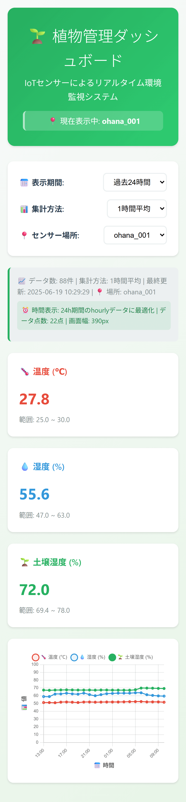
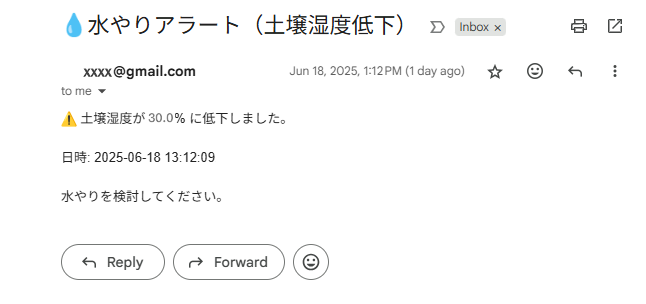

# 🌱 Plant IoT Dashboard

*Read this in other languages: [日本語](README_ja.md)*

Real-time plant health monitoring system using Raspberry Pi with environmental sensors and web-based dashboard.


## ✨ Features

- **🌡️ Environmental Monitoring**: Temperature, humidity, and soil moisture tracking
- **📊 Interactive Dashboard**: Real-time data visualization with Chart.js
- **📱 Responsive Design**: Mobile-friendly interface
- **📧 Smart Alerts**: Email notifications for low soil moisture
- **🔄 Auto Refresh**: 30-second interval updates
- **📍 Multi-Location Support**: Track multiple sensor locations
- **⏰ Flexible Time Ranges**: 1 hour to 30 days data views
- **📈 Data Aggregation**: Raw, hourly, and daily averaging

## 🛠️ Hardware Requirements

- Raspberry Pi (3B+ or newer)
- DHT11 Temperature/Humidity Sensor
- SEN0193 Soil Moisture Sensor
- MCP3008 ADC (for soil sensor)
- Breadboard and jumper wires

## 🔌 Wiring Diagram

```
DHT11:
- VCC → 3.3V
- Data → GPIO 14
- GND → GND

MCP3008 (for soil sensor):
- VDD → 3.3V
- VREF → 3.3V
- AGND → GND
- DGND → GND
- CLK → GPIO 11 (SCLK)
- DOUT → GPIO 9 (MISO)
- DIN → GPIO 10 (MOSI)
- CS → GPIO 8 (CE0)

SEN0193 Soil Sensor:
- VCC → 5V
- Signal → MCP3008 CH0
- GND → GND
```

## 🚀 Installation

### 1. Clone Repository
```bash
git clone https://github.com/kinarita/plant-iot-dashboard.git
cd plant-iot-dashboard
```

### 2. Install Dependencies
```bash
pip3 install -r requirements.txt
```

### 3. Enable SPI Interface
```bash
sudo raspi-config
# Interface Options → SPI → Enable
```

### 4. Configure Environment
```bash
cp .env.example .env
nano .env
# Edit with your Gmail credentials
```

### 5. Initialize Database
```bash
python3 log_sensor_data.py
```

### 6. Setup Cron Job
```bash
crontab -e
# Add line:
*/10 * * * * cd /home/aiot/plant-iot-dashboard && python3 log_sensor_data.py
```

### 7. Start Dashboard
```bash
python3 dashboard.py
```

Visit `http://your-pi-ip:8080` in your browser.

## 📊 Usage

### Dashboard Controls

- **📅 Time Range**: Select from 1 hour to 30 days
- **📈 Aggregation**: Raw data, hourly average, or daily average  
- **📍 Location**: Filter by sensor location

### Data Export

Access raw data via API:
```
GET /api/data?range=24h&aggregate=raw&location=ohana_001
GET /api/format-test  # Time format testing
```

## 📧 Email Alerts

The system automatically sends alerts when:
- Soil moisture drops below 30%
- Sensor reading failures occur
- System exceptions happen

## 🗂️ Project Structure

```
plant-iot-dashboard/
├── dashboard.py          # Web dashboard server
├── log_sensor_data.py    # Sensor data collection
├── models.py            # Database models
├── dht11.py            # DHT11 sensor driver
├── dht11_sample.py     # DHT11 sensor test program
├── sen0193.py          # Soil moisture sensor driver
├── sen0193_sample.py   # Soil moisture test program
├── requirements.txt     # Python dependencies
├── .env.example        # Environment template
└── logs/               # Application logs
```

## 🔧 Configuration

### Sensor Locations
Edit `SENSOR_LOCATION` in `log_sensor_data.py`:
```python
SENSOR_LOCATION = "ohana_001"  # Your sensor name
```

### Alert Thresholds
Modify moisture alert threshold:
```python
if soil_moisture < 30.0:  # Change threshold here
    send_moisture_alert(soil_moisture, timestamp)
```

## 📈 Data Schema

```sql
CREATE TABLE sensor_data (
    id INTEGER PRIMARY KEY,
    timestamp DATETIME,
    temperature REAL,
    humidity REAL,
    soil_moisture REAL,
    sensor_location TEXT
);
```

## 🐛 Troubleshooting

### Common Issues

1. **Permission denied on GPIO**:
   ```bash
   sudo usermod -a -G gpio $USER
   # Logout and login again
   ```

2. **SPI not enabled**:
   ```bash
   sudo raspi-config
   # Interface Options → SPI → Enable
   ```

3. **Database locked**:
   ```bash
   sudo pkill -f python3.*log_sensor
   ```

4. **Port 8080 in use**:
   ```bash
   sudo lsof -i :8080
   sudo kill -9 PID
   ```

## 📱 Screenshots

### Desktop Dashboard


### Mobile Dashboard  


### Email Alert Example

## 🤝 Contributing

1. Fork the repository
2. Create feature branch (`git checkout -b feature/amazing-feature`)
3. Commit changes (`git commit -m 'Add amazing feature'`)
4. Push to branch (`git push origin feature/amazing-feature`)
5. Open Pull Request

## 📄 License

This project is licensed under the MIT License - see the [LICENSE](LICENSE) file for details.

## 🙏 Acknowledgments

- [Bottle](https://bottlepy.org/) - Lightweight Python web framework
- [Chart.js](https://www.chartjs.org/) - Beautiful charts
- [SQLAlchemy](https://www.sqlalchemy.org/) - Database toolkit
- Raspberry Pi Foundation for the amazing hardware

## 📞 Support

If you have questions or issues:
- Open an [Issue](https://github.com/yourusername/plant-iot-dashboard/issues)
- Check [Documentation](docs/)
- Email: kinarita@gmail.com

---

**Made with 🌱 for healthy plants and happy gardeners!**
=======
# plant-iot-dashboard
 🌱 IoT Plant Monitoring Dashboard - Real-time plant health monitoring with Raspberry Pi sensors
